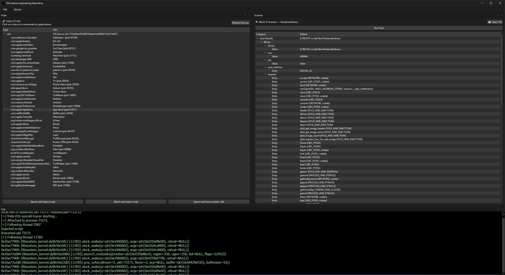

# iOS-re-studio



WIP reverse engineering suite for iOS applications. Detects common anti-reverse-engineering techniques and protectors in 64-bit Mach-O binaries. Made possible with [LIEF](https://lief.re/), [Capstone](http://www.capstone-engine.org/) and [YARA](https://github.com/VirusTotal/yara). UI based on PySide6.

## Features

- Anti-Reversing detections
  - Anti-Jailbreak (open/access/stat64, URL schemes, fork, symlinks, dyld...)
  - Syscall detections (ptrace, exit...)
  - Suspicious imports (sysctl, dlsym, getppid...)
  - Timing / anti-breakpoint heuristics
  - Emulator checks
  - Integrity checks
  - Frida checks
  - Protector detection using YARA
- WIP: Obfuscation detection
- WIP: Integrated LLDB-based debugger
- WIP: Integrated disassembler
- WIP: Integrated decompiler
- WIP: Full framework integration (Frida, LIEF, QBDI etc.)

## Requirements

- Python (>= 3.12.1 recommended)
- pip

## Installation

This might take a while.

```bash
pip install -r requirements.txt
```

## Usage

```bash
python app.py
```

## Example output (CLI)

```plain
[*] Analysis started: cpu=ARM64, imagebase=0x100000000, pie=True
[*] Scanning for protectors...
[!] YARA match
    description: Promon SHIELD (commercial)
    url: https://promon.io/products/mobile
[*] Scanning symbols...
[*] Note: Strings might be encrypted, encoded or otherwise obfuscated.
[!] Suspicious symbol: /bin/bash (ANTI_JAILBREAK_STRING, section=__const)
[!] Suspicious symbol: dlopen (DYLD_AND_INJECTION)
[!] Suspicious symbol: dlsym (DYLD_AND_INJECTION)
[!] Suspicious symbol: dyld_get_image_name (DYLD_AND_INJECTION)
[!] Suspicious symbol: dyld_image_count (DYLD_AND_INJECTION)
[!] Suspicious symbol: open (LIBC_POSIX)
[!] Suspicious symbol: socket (NETWORK)
[!] Suspicious symbol: stat (LIBC_POSIX, rodata)
[!] Suspicious symbol: sysctl (SYSCTL)
[!] Suspicious symbol: sysctlbyname (SYSCTL)
[!] Suspicious symbol: system (LIBC_POSIX, rodata)
[!] Suspicious symbol: task_info (MACH_TASK_AND_VM)
[*] Use cross-references to check if these symbols are actually harmful.
[*] Scanning syscalls... This might take a while, every instruction must be disassembled.
[*] Found 3 code sections: __text, __objc_stubs, __stubs
[1] exit @ 0x3c1a8
[1] exit @ 0x3d420
[26] ptrace @ 0x3e22c
[1] exit @ 0x3e23c
[26] ptrace @ 0x3e63c
[26] ptrace @ 0x43184
...
[*] Section __text: 4350 syscalls found
[*] Results written to out.json
````

## Roadmap

- Handle obfuscated syscalls. Unicorn emulation might be necessary. Example:

```arm
ldr x16, [sp, #0x288]
svc 0x80
```

- Output IDA-friendly addresses instead of file offsets
- Offer automatic patches (NOP, RET etc.)
- Add more detections
- GUI
- Support ARM32?
- ...
